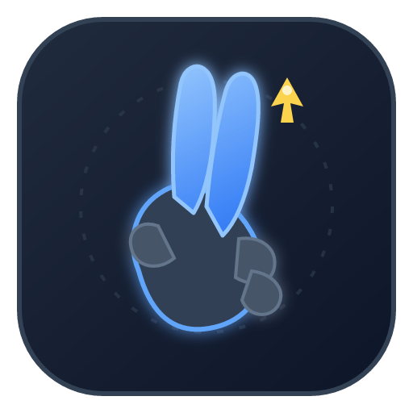

# 凌虚指 · AirSword

<p align="center">
  
</p>

<p align="center">
  <strong>隔空御剑，剑指为鼠</strong><br/>
  用笔记本摄像头识别手势，把「剑指」变成鼠标
</p>

---

## 这是什么

**凌虚指（AirSword）** 是一款 Windows 桌面工具：前置摄像头捕捉手部 21 关键点，识别剑指 / 捏合 / 张开等手势，经平滑与死区处理后，通过系统级鼠标仿真控制指针、点击与滚轮。

面向「手不想碰触控板 / 鼠标」的场景：演示讲解、沙发躺用、无键鼠临时操控等。

| 项 | 说明 |
|----|------|
| 平台 | Windows 10 / 11（x64） |
| 技术 | .NET 8 · WinUI 3 · OpenCV DNN（ONNX）· Autofac |
| 识别 | 手掌检测 + 21 关键点估计（OpenCV Zoo MediaPipe 风格模型） |
| 控制 | `IMouseController` 抽象，默认 Win32 `SendInput` 实现 |

仓库 / 命名空间：`LingXuZhi`　对外品牌：**AirSword**

---

## 快速开始

### 环境

- Windows 10 1809+ / Windows 11
- [.NET 8 SDK](https://dotnet.microsoft.com/download/dotnet/8.0)
- 可用的摄像头（建议前置）
- Visual Studio 2022（可选，带 WinUI 工作负载）

### 构建与运行

```bash
git clone https://github.com/biu8bo/LingXuZhi.git
cd LingXuZhi
dotnet build LingXuZhi.sln -c Debug -p:Platform=x64
dotnet run --project src/LingXuZhi.App/LingXuZhi.App.csproj -c Debug -p:Platform=x64
```

首次启动会枚举摄像头并打开预览。设置面板中确认 **「启用鼠标仿真」**（默认已开启），再按下方手势操作。

### 单元测试

```bash
dotnet test tests/LingXuZhi.Core.Tests/LingXuZhi.Core.Tests.csproj
```

---

## 手势使用说明

手势基于 **MediaPipe 式 21 关键点**。指针采样点为 **食指尖(8) 与中指尖(12) 的中点**。  
识别经状态机 **去抖**（默认连续 3 帧）后才会切换，减少误触。

### 1. 剑指 · 移动鼠标

| | |
|--|--|
| **手势** | 食指、中指伸直并拢；无名指、小指弯曲；拇指收拢 |
| **动作** | 指针跟随两指尖中点平滑移动 |
| **提示** | 手在画面 **中央死区**（预览上的虚线圆）内静止时，鼠标 **不移动**；离开死区后才继续跟随 |

适合日常移动光标。默认镜像开启，前置摄像头下左右方向符合直觉。

### 2. 食指–拇指捏合 · 左键单击

| | |
|--|--|
| **手势** | 食指尖靠近拇指尖（捏合距离低于阈值）；中指保持伸直 |
| **动作** | 触发 **一次** 左键单击（按下即释放，本版本不做拖拽按住） |
| **提示** | 捏住不放不会连点；松开后可再次捏合点击 |

### 3. 食指–中指捏合 · 右键单击

| | |
|--|--|
| **手势** | 食指、中指均伸直但两指尖靠拢（捏合） |
| **动作** | 触发 **一次** 右键单击 |
| **提示** | 与剑指区分：剑指两指并拢但保持「伸直指向」；右键是两指尖明显贴近 |

### 4. 五指张开 · 滚轮

| | |
|--|--|
| **手势** | 拇指 + 四指全部伸直张开 |
| **动作** | 进入滚轮模式后，**上下摆动手掌** 触发滚轮；默认每次滚动 3 行 |
| **提示** | 向上摆 → 滚轮向上；向下摆 → 滚轮向下。每次触发后需 **回中** 才能再次滚动，避免持续狂滚 |

### 5. 空闲

以上均不满足时进入空闲，不产生鼠标动作（预览与调试数据仍可刷新）。

### 推荐练习流程

1. 打开应用，面对摄像头，手完整入画  
2. 做 **剑指**，观察预览十字线与指针跟随  
3. 移入中央死区，确认指针停下  
4. **食指–拇指捏合** 左键；**食指–中指捏合** 右键  
5. **五指张开**，上下摆动手掌试滚轮  
6. 若不需要控鼠，关闭设置中的「启用鼠标仿真」（仅可视化）

### 可调参数（设置面板）

| 参数 | 作用 | 默认倾向 |
|------|------|----------|
| 镜像翻转 | 前置摄像头左右镜像 | 开 |
| 鼠标灵敏度 | 以画面中心为锚放大偏移 | 1.5 |
| 平滑系数 | 越大越稳（内部映射为更小的 EMA α） | 0.7 |
| 死区半径 | 画面中央静止区（像素） | 40 |
| 捏合阈值 | 相对手掌宽度 | 0.05 |
| 去抖帧数 | 状态切换所需连续帧 | 3 |
| 滚轮行数 | 每次摆动滚动行数 | 3 |
| 启用鼠标仿真 | 总开关 | 开 |

---

## 功能一览

- 摄像头预览 + 骨架 / 手部旋转框叠加  
- 死区圆、指针十字、当前手势文字叠加  
- 调试面板：手势状态、状态转移、平滑前后坐标、死区命中、鼠标位移、点击/滚轮计数  
- 底部运行日志；全局异常写入 `crash.log` 并回显日志面板  
- 鼠标实现可替换（抽象 / SendInput 分项目）

---

## 项目结构

```
LingXuZhi/
├── assets/                              # 品牌资源（SVG 源、PNG、ICO）
│   ├── logo.svg
│   ├── logo.png
│   └── App.ico
├── prompts/                             # 分阶段开发提示词
├── src/
│   ├── LingXuZhi.App/                   # WinUI 3 主程序
│   │   ├── Assets/                      # 应用图标（运行时拷贝）
│   │   ├── Controls/                    # 预览叠加、设置、调试面板
│   │   ├── Diagnostics/                 # 全局异常捕获
│   │   ├── Hosting/                     # Autofac 装配
│   │   ├── Services/                    # 手部追踪、手势→鼠标桥接
│   │   ├── ViewModels/
│   │   └── Views/
│   ├── LingXuZhi.Core/                  # 手势 / 平滑 / 死区 / 管线（零平台依赖）
│   │   ├── Configuration/
│   │   ├── Gestures/
│   │   ├── Pipeline/
│   │   └── Tracking/
│   ├── LingXuZhi.Vision.Abstractions/   # 视觉接口与纯数据类型
│   ├── LingXuZhi.Vision.OpenCv/         # OpenCV DNN + ONNX 实现与模型
│   ├── LingXuZhi.Vision.MediaPipe/      # MediaPipe 预留占位
│   ├── LingXuZhi.Platform/              # 摄像头等平台能力
│   ├── LingXuZhi.Platform.Mouse.Abstractions/  # IMouseController
│   └── LingXuZhi.Platform.Mouse.SendInput/    # SendInput 实现
└── tests/
    └── LingXuZhi.Core.Tests/            # 手势、状态机、平滑等单测
```

### 关键分层

| 接口 | 职责 | 当前实现 | 可替换方向 |
|------|------|----------|------------|
| `IHandDetector` | 帧 → 手掌框 | OpenCvPalmDetector | MediaPipe Palm |
| `IHandLandmarker` | ROI → 21 点 | OpenCvHandLandmarker | MediaPipe Hand |
| `ICameraSource` | 采集帧流 | OpenCvVideoCaptureSource | MediaFoundation 等 |
| `IMouseController` | 移动 / 点击 / 滚轮 | WindowsSendInputMouseController | 其他模拟库 |
| `IGestureRecognizer` | 21 点 → 手势观测 | DefaultGestureRecognizer | 自定义规则 |

**红线**：`LingXuZhi.Core` 不引用 OpenCvSharp、ONNX、WinUI、Win32。换视觉后端或鼠标库只需改 DI 注册。

### 数据流

```
摄像头帧
  → ICameraSource
  → HandTrackingService（检测 + 关键点）
  → GestureControlService / GesturePipeline
       识别 → EMA 平滑 → 死区 → 状态机 → MouseAction
  → IMouseController（若启用仿真）
  → UI 预览叠加 + 调试面板
```

---

## 品牌与图标

源文件在 `assets/`：

- `logo.svg` — 矢量原稿（剑指手势 + 光标火花，深色 slate + 蓝 + 琥珀）  
- `logo.png` — 高清位图（README / 宣传）  
- `App.ico` — 多尺寸图标（16～256）  

应用侧：`ApplicationIcon`、任务栏 `AppWindow.SetIcon`、标题栏 Logo 图均已接入。

重新从 SVG 出图时，可用 [resvg](https://github.com/RazrFalcon/resvg) 等工具栅格化后再打 ICO。

---

## 开发阶段

| 阶段 | 文档 | 状态 |
|------|------|------|
| 1 | `prompts/01-skeleton-and-ui.md` | 完成 · 骨架与界面 |
| 2 | `prompts/02-vision-and-visualization.md` | 完成 · 识别与可视化 |
| 3 | `prompts/03-tracking-and-mouse-simulation.md` | 完成 · 手势追踪与鼠标仿真 |

---

## 已知限制

- 本版本 **不支持拖拽按住**、多手、惯用手切换、自定义手势  
- 强逆光 / 手出画 / 遮挡会导致识别中断  
- 自包含 WinAppSDK 输出体积较大；构建会裁剪多余语言资源目录（保留 `zh-CN` / `en-us`）

---

## 许可证与贡献

开源仓库：<https://github.com/biu8bo/LingXuZhi>  

欢迎 Issue / PR。改动请尽量保持 Core 无平台依赖，并补齐相关单测。
